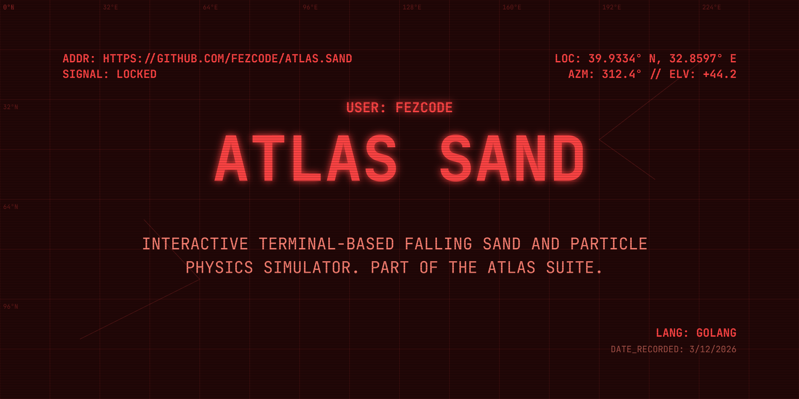

# Atlas Sand



**atlas.sand** is a meditative particle physics simulator that lives entirely in your terminal. Part of the **Atlas Suite**, it allows you to play with cellular automata physics—dropping sand, water, and fire to see how they interact in a low-fi, high-tactile environment.


## ✨ Features

- ⏳ **Real-time Physics:** Dynamic simulation of sand, liquids, and gases.
- 🔥 **Element Interactions:** Water puts out fire, sand builds piles, and more.
- ⌨️ **Keyboard & Mouse Control:** Drop particles with your mouse or navigate with keys.
- 🎨 **Brutalist Aesthetics:** Clean, ASCII-based visual style.
- 📦 **Zero Dependencies:** Pure Go implementation, works everywhere.

## 🚀 Installation

### From Source
```bash
git clone https://github.com/fezcode/atlas.sand
cd atlas.sand
go build -o atlas.sand .
```

## 🕹️ Controls

| Key | Action |
|-----|--------|
| `1-5` | Select Material (Sand, Wall, Water, Fire, Salt) |
| `Mouse Click` | Drop selected material |
| `Space` | Pause / Resume simulation |
| `c` | Clear the screen |
| `q / Ctrl+C` | Quit |

## 🏗️ Building for all platforms

The project uses **gobake** to generate binaries for all platforms:

```bash
gobake build
```

## 📄 License
MIT License - see [LICENSE](LICENSE) for details.
